<div align="center">

<picture>
  <source media="(prefers-color-scheme: dark)" srcset="./dark.svg">
  <source media="(prefers-color-scheme: light)" srcset="./light.svg">
  
</picture>

<br>

# pgrd1

### System Architect · Backend Engineer · Full Stack Developer

Reliable systems, scalable backends, and developer-focused tools.

[](https://liveforest.kr)
[](https://github.com/pgrd1)


</div>

---

## About Me

Software Engineer focused on building scalable backend systems,
high-performance applications, reliable infrastructure, and developer tooling.

I enjoy designing maintainable architectures, optimizing database performance,
automating repetitive workflows, and turning complex requirements into stable products.

My primary areas of interest include:

* Backend and API architecture
* Database design and performance optimization
* Distributed systems and network programming
* Developer tools and automation
* Cross-platform application development
* Game server infrastructure and integrations

---

## Core Expertise

<table>
<tr>
<td width="50%" valign="top">

### Backend Engineering

* REST API design and development
* Real-time communication with WebSocket
* Authentication and authorization systems
* Background jobs and event-driven workflows
* External service and platform integrations
* Modular and maintainable backend architecture

</td>
<td width="50%" valign="top">

### Database Engineering

* Relational database modeling
* Query and index optimization
* Transaction and concurrency management
* Connection pooling and caching
* Data migration and synchronization
* Backup and recovery strategies

</td>
</tr>

<tr>
<td width="50%" valign="top">

### Systems Engineering

* Network communication and protocol handling
* Concurrent and asynchronous programming
* Performance profiling and optimization
* Distributed service architecture
* Cross-platform system development
* Reliable error handling and monitoring

</td>
<td width="50%" valign="top">

### Infrastructure

* Linux and Windows server environments
* Docker-based service deployment
* Reverse proxy and network configuration
* CI/CD workflow automation
* Cloudflare and domain infrastructure
* Secure database and service configuration

</td>
</tr>
</table>

---

## Tech Stack

### Languages

<p>
  
</p>

`C++` `Java` `Python` `TypeScript` `JavaScript` `Kotlin` `SQL`

### Backend & APIs

<p>
  
</p>

`Spring` `FastAPI` `Node.js` `REST API` `WebSocket` `gRPC`

### Database & Caching

<p>
  
</p>

`PostgreSQL` `MySQL` `Redis` `SQLite`

### Infrastructure & Tools

<p>
  
</p>

`Docker` `Linux` `Git` `GitHub Actions` `Nginx` `Cloudflare`

---

## Engineering Experience

```text
Backend Architecture       ███████████████████░
Database Engineering       ███████████████████░
System Design              ██████████████████░░
API Development            ██████████████████░░
Automation                 ███████████████████░
Network Infrastructure     █████████████████░░░
Performance Optimization   █████████████████░░░
Cross-platform Development ████████████████░░░░
```

---

## Featured Areas

### Backend Platforms

Designing backend services that handle authentication, account linking,
permissions, messaging, transactions, scheduled tasks, and external integrations.

### Database Systems

Building PostgreSQL and Redis-based systems with structured schemas,
connection pooling, caching, synchronization, and query optimization.

### Developer Tools

Creating scripts, utilities, build tools, automation systems,
asset-processing pipelines, and internal development frameworks.

### Networked Applications

Developing services that communicate across proxies, application servers,
databases, Discord, websites, and external APIs.

### Minecraft Ecosystem

Developing cross-platform Minecraft infrastructure using technologies such as
Velocity, Geyser, Floodgate, PostgreSQL, Redis, Java, Python, and custom APIs.

Minecraft development is one part of a broader focus on backend, database,
network, automation, and distributed system engineering.

---

## Projects

### Open Source Projects

Reusable libraries, utilities, development tools, and automation workflows
designed to simplify complex development processes.

### Backend Frameworks

Modular backend foundations for authentication, permissions, messaging,
payments, account linking, and service integrations.

### Database Platforms

Database-centered systems for persistent player data, logs, transactions,
synchronization, analytics, and administrative tools.

### Automation Systems

Automation tools for file processing, image generation, deployment, backups,
monitoring, data transformation, and server management.

### Liveforest Bedrock Server

A cross-platform service ecosystem combining game servers, backend services,
databases, websites, Discord integrations, and infrastructure automation.

---

## Current Focus

```yaml
distributed_systems:
  - service communication
  - synchronization
  - fault tolerance

backend_architecture:
  - modular services
  - authentication
  - real-time APIs

database_engineering:
  - PostgreSQL
  - Redis
  - query optimization
  - schema design

developer_tools:
  - automation
  - build systems
  - internal utilities

cross_platform:
  - Windows
  - Linux
  - Web
  - JVM
```

---

## Development Principles

```text
01. Reliability before unnecessary complexity
02. Clear architecture before rapid expansion
03. Measurable optimization instead of assumptions
04. Secure defaults for every external service
05. Maintainable code over temporary shortcuts
06. Automation for repetitive operational work
```

---

## GitHub Activity

<div align="center">


</div>

<div align="center">


</div>

---

## Contact

<div align="center">

Open to discussions about backend systems, database architecture,
developer tooling, infrastructure, and open-source projects.

[](https://liveforest.kr)
[](https://github.com/pgrd1)

<br>

<sub>Built with pure SVG, SMIL animation, and Markdown.</sub>

</div>
